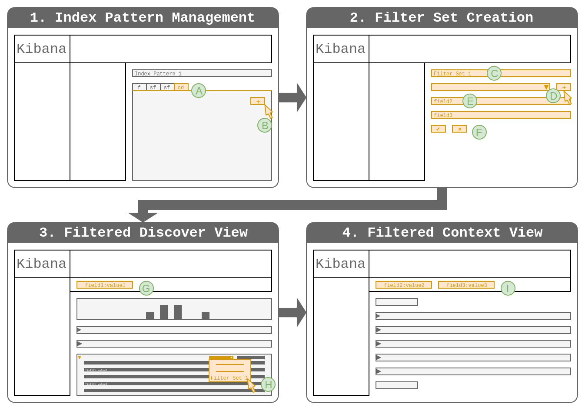
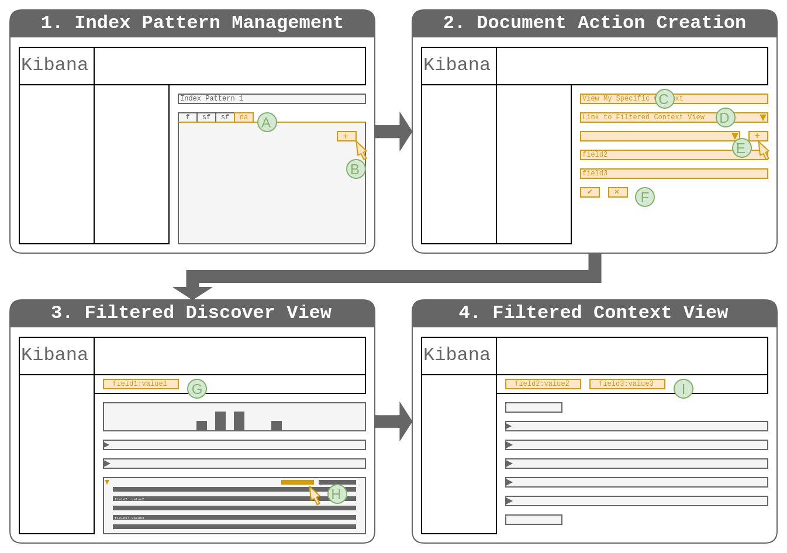
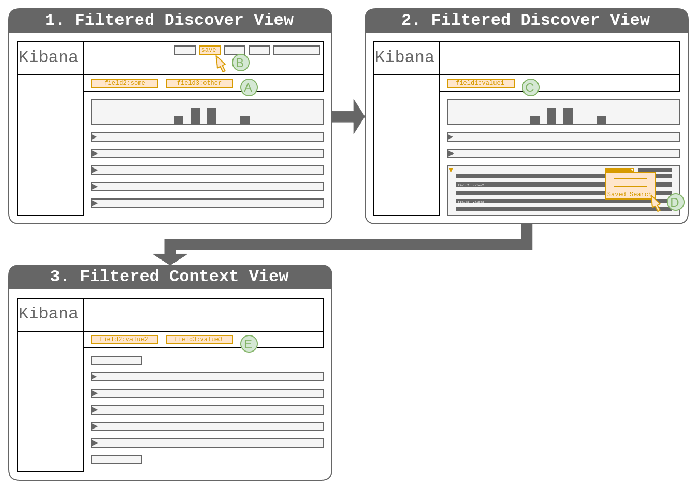

# Solution 4: Create a filter based on preconfigured settings

## Outline

1. The user configures sets of filters for the index pattern/saved search that
   defined contexts.
2. The user creates a set of filters and a query to identify the anchor event.
3. The user clicks the UI element to switch to the context view with a specific
   preconfigured set of filters.
4. The context view is filtered by the preconfigured set of filters.

## Discussion

* **PRO**: The context can be defined via multiple filters.
* **PRO**: The context is immediately "useful".
* **CON**: The concept of sets of filters that can be preconfigured is new to
  Kibana and would require significant design and implementation effort.

This solution essentially adds a very limited version of parameterized links to
other saved searches. An implementation could lay the foundation for more
generic capabilities of linking to other parts of Kibana from the doc table
(which is a frequently mentioned requirement). This also shows some relation to
elastic/kibana#10761 (being able to define parameterized outgoing links to
other webapps).

## Variations

This section explores more detailed variations of the solution. They relate to
different degrees of freedom of the implementation. The overall solution will
therefore be a combination of these:

* **D**efinition: the format in which the preconfigured settings are stored and 
  the user process to change them
* **C**ardinality: the cardinality of the relationships between the domain 
  objects
* **S**election: the process and timing of selecting the set of filters

### Variation D1: Filter Set Definition per Index Pattern

* The index pattern configuration screen in the Management section contains the
  ability to define filter sets for that index pattern.
* The user can choose one of the filter sets defined for the current index
  pattern to apply to the context view.

#### Discussion

* **PRO**: It is easy to ensure that the filter definitions make sense for the
  given index pattern.
* **PRO**: Configuring complex options for index patterns is an established
  pattern.
* **CON**: The index pattern configuration becomes more bloated.
* **CON**: The index pattern model must be extended.
* **CON**: The removal of index patterns is under consideration.
* **CON**: The filter set definitions can not be re-used across index patterns.

### Variation D2: Filter Set Definition per Saved Search

* The saved search configuration contains an interface to define filter sets
  for that saved search.
* The user can choose one of the filter sets defined for the current saved
  search to apply to the context view.

#### Discussion

* **PRO**: It is easy to ensure that the filter definitions make sense for the
  given saved search.
* **CON**: The saved search model must be extended.
* **CON**: The filter set definitions can not be re-used across saved searches.
* **CON**: Configuring complex options for saved searches is not an established
  pattern.

### Variation D3: Implicit Filter Set Definitions from Saved Searches

* The user can choose any of the saved searches to apply as a filter set to the
  context view.
* All "Term" filters defined on the targeted saved search for which matching
  fields exist in the anchor are modified to match the anchor document's
  values.

#### Discussion

* **PRO**: Saving filters in saved searches is already an established pattern.
* **PRO**: No saved object model must be extended.
* **PRO**: The context can even use a saved search based on a different index
  pattern to switch the point of view for the context.
* **CON**: Extends the semantics of the "saved search" concept and might therefore
  limit degrees of freedom for future changes to saved searches.
* **CON**: More complex "saved search" concept harder for user to understand.

### Variation D4: Implicit Filter Set Definitions via Configurable Document Actions per Index Pattern

* The index pattern configuration contains an interface to define document 
  actions.
* One of the available action types is "Link to Filtered Context View".
* When adding an action of that type, the user defines which filters to apply 
  to the target context view.

#### Discussion

* **PRO**: It is easy to ensure that the filter definitions make sense for the
  given index pattern.
* **PRO**: Configuring complex options for index patterns is an established 
  pattern.
* **PRO**: The ability to configure the available actions for documents is 
  applicable to other use-cases as well (direct linking to visualizations, 
  drill-down based on document values).
* **CON**: The index pattern configuration becomes more bloated.
* **CON**: The index pattern model must be extended.
* **CON**: The removal of index patterns is under consideration.
* **CON**: The filter set definitions can not be re-used across index patterns.
  pattern.

### Variation D5: Implicit Filter Set Definitions via Configurable Document Actions per Saved Search

* The saved search configuration contains an interface to define document 
  actions.
* One of the available action types is "Link to Filtered Context View".
* When adding an action of that type, the user defines which filters to apply 
  to the target context view.

#### Discussion

* **PRO**: It is easy to ensure that the filter definitions make sense for the
  given saved search.
* **PRO**: The ability to configure the available actions for documents is 
  applicable to other use-cases as well (direct linking to visualizations, 
  drill-down based on document values).
* **CON**: The saved search model must be extended.
* **CON**: The filter set definitions can not be re-used across saved searches.
* **CON**: Configuring complex options for saved searches is not an established
  pattern.

### Variation C1: One-to-One Association of Index Pattern/Saved Search and Filter Set

* Can be combined with D1 or D2.
* For each index pattern (D1) or saved search (D2) the user can define one
  filter set.

#### Discussion

* **PRO**: Simplicity in implementation and user interface for both the definition
  and the selection of the filter set.
* **CON**: The context is fixed to a particular perspective thereby limiting the
  applicability to some use-cases.

### Variation C2: One-To-Many Association of Index Pattern/Saved Search and Filter Set

* Can be combined with D1 or D2.
* For each index pattern (D1) or saved search (D2) the user can define one or
  more filter sets.

#### Discussion

* **PRO**: The user can apply one of several context definitions depending on the
  use-case.
* **CON**: Complexity in implementation and user interface for both the definition
  and the selection of the filter set.

### Variation C3: No Fixed Association of Index Pattern/Saved Search and Filter Set

* Always true for D3.

#### Discussion

* **PRO**: The user has maximum flexibility to implement her use case.
* **CON**: The user interface can only provide limited guidance for the user due to
  the lack of semantic association between the saved objects.

### Variation S1: Fixed Filter Set for Index Pattern/Saved Search

* Always true for C1.
* The filter set applied after switching to the context view is always the
  same.

#### Discussion

* **PRO**: Simple user interface
* **CON**: Limited flexibility

### Variation S2: Filter Set Selection Before Switching to the Context View

#### Discussion

* **PRO**: The context view is immediately useful.
* **CON**: The user has to determine the perspective before entering the context view.

### Variation S3: Filter Set Selection After Switching to the Context View

#### Discussion

* **PRO**: The user can easily switch perspectives after entering the context view
* **CON**: The context view needs setup before being "useful".

## Workflows

### Workflow 1

* Combination of D1, C2 and S2

* **A**: The user visits the "Context Definitions" (preliminary term) tab in 
  the index pattern settings.
* **B**: The user clicks the "Add Context Definition" button.
* **C**: The user enters a name in the "Edit New Context Definition" screen.
* **D**: The user selects fields from the index pattern to add to the context 
  definition.
* **E**: The user views and modifies the list of fields in the context 
  definition.
* **F**: The user saves the context definition.
* **G**: The user uses the filters and query bar to find relevant events in the 
  Discover view.
* **H**: The user expands a row, opens the dropdown that lists all context 
  definitions of the current index pattern and clicks one of them.
* **I**: The context view is filtered by term filters for the fields associated 
  with the selected context definition using the values from the document 
  expanded in step H.

### Workflow 2

* Combination of D4, C2 and S2

* **A**: The user visits the "Document Actions" (preliminary term) tab in 
  the index pattern settings.
* **B**: The user clicks the "Add Document Action" button.
* **C**: The user enters a name in the "Edit New Document Action" screen.
* **D**: The user selects the "Link to Filtered Context View" action type from 
  the dropdown menu that lists all available document action types.
* **E**: The user selects fields from the index pattern to add as filters to 
  the document action.
* **F**: The user saves the document action.
* **G**: The user uses the filters and query bar to find relevant events in the 
  Discover view.
* **H**: The user expands a row and clicks the link corresponding to the 
  previously created document action.
* **I**: The context view is filtered by term filters for the fields configured
  for the selected document action using the values from the document expanded 
  in step H.

### Workflow 3

* Combination of D3, C3 and S2

* **A**: The user creates a set of term filters with arbitrary values to use as 
  filters for the context in the Discover view.
* **B**: The user saves the set of filters as a saved search.
* **C**: The user uses the filters and query bar to find relevant events in the 
  Discover view.
* **D**: The user expands a row, opens the dropdown that lists all saved 
  searches available for use as context filters and clicks one of them.
* **E**: The context view is filtered by all term filters configured
  in the selected saved search for which corresponding values exist in the 
  document expanded in step H.
